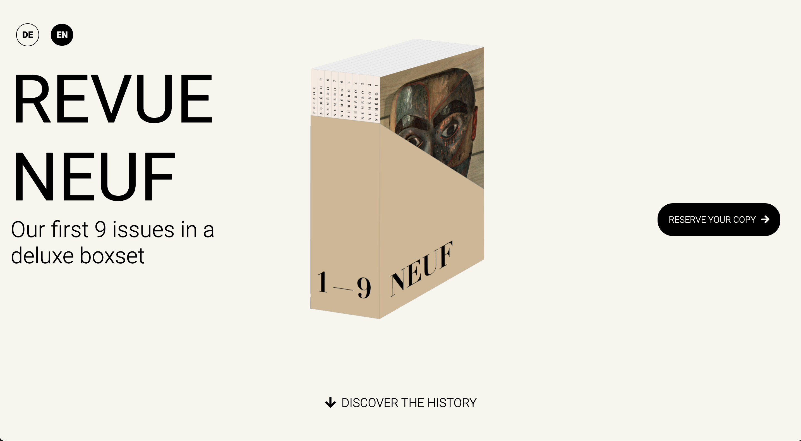

# Magazine Landing Page

In dieser Übung erstellen wir eine Magazin Landing Page wie im Bild unten dargestellt:

### Anleitung

> - Die Pfeil-Icons sind von **Fontawesome** - benutzt die `::before` und `::after` Pseudo-Elemente, um sie einzubauen
> - Als Schriftart wird _Roboto_ von **Google Fonts** benutzt
> - Verwendet `flex` - `position` wird für dieses Layout nicht benötigt!
> - Verwendet `:hover` Effekte nach eigenem Geschmack
